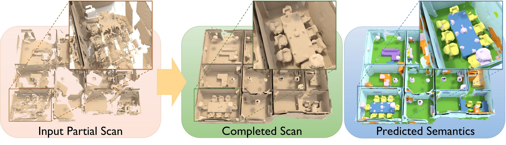

# ScanComplete

ScanComplete is a data-driven approach which takes an incomplete 3D scan of a scene as input and predicts a complete 3D model, along with per-voxel semantic labels. This work is based on our CVPR'18 paper, [ScanComplete: Large-Scale Scene Completion and Semantic Segmentation for 3D Scans](https://arxiv.org/pdf/1712.10215.pdf).

[](https://arxiv.org/abs/1712.10215)


## Code
### Installation:  
Training is implemented with [TensorFlow](https://www.tensorflow.org/). This code is tested under TF1.3 and Python 2.7 on Ubuntu 16.04.

### Training:  
* See `run_train.sh` for calling the training (will need to provide a path to the train data).
* Trained models: [models.zip](http://dovahkiin.stanford.edu/scancomplete-public/models.zip)
* See `run_complete_scans_hierarchical.sh` for testing on partial scans (needs paths to test data and model).

### Data:
* Test scenes as TF Records: 
  - [vox5.zip](http://dovahkiin.stanford.edu/scancomplete-public/data/test/vox5.zip) (4G)
  - [vox9.zip](http://dovahkiin.stanford.edu/scancomplete-public/data/test/vox9.zip) (620M)
  - [vox19.zip](http://dovahkiin.stanford.edu/scancomplete-public/data/test/vox19.zip) (105M)
* Train data as TF Records:
  - [vox19_dim32.zip](http://dovahkiin.stanford.edu/scancomplete-public/data/train/vox19_dim32.zip) (12G) for training the 19cm hierarchy level
  - [vox5-9-19_dim32.zip](http://dovahkiin.stanford.edu/scancomplete-public/data/train/vox5-9-19_dim32.zip) (240G) for training the 9cm and 5cm hierarchy levels. IMPORTANT: For training a hierarchy with more than just the finest level (e.g., 19-9-5 or 9-5 instead of just 5cm), the finer levels should be trained using the results from the trained model from the previous hierarchy level; i.e. this data will need to be edited.


## Citation:  
If you find our work useful in your research, please consider citing:
```
@inproceedings{dai2018scancomplete,
  title={ScanComplete: Large-Scale Scene Completion and Semantic Segmentation for 3D Scans},
  author={Dai, Angela and Ritchie, Daniel and Bokeloh, Martin and Reed, Scott and Sturm, J{\"u}rgen and Nie{\ss}ner, Matthias},
  booktitle = {Proc. Computer Vision and Pattern Recognition (CVPR), IEEE},
  year = {2018}
}
```

## Contact:
If you have any questions, please email Angela Dai at adai@cs.stanford.edu.
